### Django

[Repo](https://github.com/tombohub/simple-django-todo)

#### Model

I knew django before so this was the easiest one. Django has straight forward model definition. Just create a class:

```python
from django.core.validators import MinLengthValidator
from django.db import models


class Todo(models.Model):
    class Status(models.TextChoices):
        DONE = "Done", "Done"
        NOT_DONE = "Not Done", "Not Done"

    title = models.CharField(max_length=20, validators=[MinLengthValidator(3)])
    status = models.TextField(choices=Status.choices, default=Status.NOT_DONE)
```

create migration file:

```console
python ./manage.py makemigration
```

It will name and create a migration file. Then run migrations:

```console
python ./manage.py migrate
```

It's the easiest model creation and migration I've tried so far out of any framework. Top notch.

Everything else pretty normal. Django is more explicit compared to rails and laravel. For that reason, I believe, it doesn't have cli generators. Less conventions.

#### Template

In django template we cannot use the python code so we need to resort to things like:

```html
<button>
   Mark not done  Mark done 
</button>
```

or create a [filter](https://docs.djangoproject.com/en/5.1/howto/custom-template-tags/) and use it:

```html
<button>{{todo.status|toggle_status_label}}</button>
```

#### Forms

Django has [form framework](https://docs.djangoproject.com/en/5.1/topics/forms/). Makes it super easy to go from model->template. This is what makes it rapid development. People will say it's an antipattern, but purpose of django is to publish articles on news website with some data in it. That was very clever from the creator of Django. It makes me even more bamboozled why was he also against the logic in templates saying it's an antipattern. I would say go all the way and allow logic in templates and be even more rapid dev framework man. Just do it.

### Rails

[Repo](https://github.com/tombohub/simple-rails-todo)

#### Magic

This one took me a while. There is a lot of conventions to know regarding route names, using request data in controller and especially [Turbo](https://turbo.hotwired.dev/). Turbo is default and integrated with forms and links.

For example, no need to pass params into the controller action it's automatically present:

```ruby
def destroy
    @todo = Todo.find(params[:id])
    @todo.destroy
    redirect_to todos_path, notice: "Todo deleted"
  end
```

Also, because of class attributes, we don't need to pass context when rendering another action:

```ruby
  def create
    @todo = Todo.new(todo_params)
    if @todo.save
      redirect_to todos_path, notice: "Todo was created"
    else
      @todos = Todo.all
      render :index
    end
  end
```

```ruby
@todos = Todo.all # @todos is present in index template
render :index
```

Unlike Django where we need to be explicit:

```python
todos = Todo.objects.all()
return render(request, "todoist/index.html", {'todos': todos})
```

#### Template

Good thing is we can use ruby inside template:

```ruby
<%= link_to (todo.status == 'Not Done' ? 'mark done' : 'mark not done'), toggle_status_todo_path(todo), data: { turbo_method: :post } %>
```

### Laravel

[Repo](https://github.com/tombohub/simple-laravel-todo)

#### Model

Laravel migrations:

```php
return new class extends Migration
{
    /**
     * Run the migrations.
     */
    public function up(): void
    {
        //
    }

    /**
     * Reverse the migrations.
     */
    public function down(): void
    {
        //
    }
};
```

This is it. It's up to you to fill out everything. Laravel takes total opposite approach from Django ORM.

#### Types

One thing I miss in these 3 frameworks is typings. Especially in templates. I don't know the best setup. In vscode I got some spelling errors which didn't show in vscode, but was runtime error. I'd rather have squiggly lines telling me errors.

#### Thoughts

All in all, this is good framework with lot of batteries included. Lot of magic strings. If I had to choose out of big 3 maybe I would choose this one because it's most straight forward and richest UI support. Blade components, Inertia, Livewire. I have found out that for simpleish apps UI takes most of the time. So UI tools and support are super important. Django is worst in this department.

Too bad Laravel ORM is not to my liking. Django is far better for me. Other than that I think I've enjoyed this one the most. Balanced convention - configuration ratio. Everything flows smoothly into each other like Danube river into the Black sea.

### Phoenix

[Repo](https://github.com/tombohub/simple_phoenix_todo)

#### Vscode support

Copilot is already lacking. I can see this is gonna be a problem. It told me to do so much stuff and configuration while command `mix phx.gen.schema Todo title:string` is sufficient.

I got stuck because vscode adds parenthesis upon save while GPT tells me not to add parenthesis:

```elixir
schema "todos" do
    field :status, Ecto.enum(), values: [:done, :not_done]
    field :title, :string
```

and I get the error undefined function:

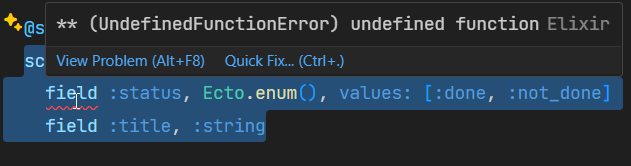

I've tried googling, but all the solutions are same and still getting error. This is too much time now. I am giving up on enum and will validate model on creation.

It warns me if path doesn't exist which is really neat and makes it less stringly typed:

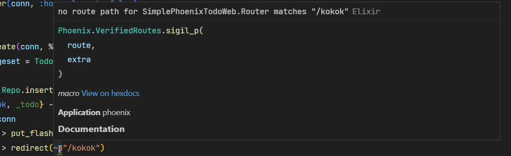

#### Live reload

It has live reload. Changes to templates are automatically refreshed which is very nice!

#### Copilot

Using chat GPT. I am not confident in Copilot for Phoenix.

#### Documentation

Trying to make a form I couldn'f find anything about it in [phoenix docs](https://hexdocs.pm/phoenix/overview.html), so I google and found something in [hexdocs](https://hexdocs.pm/phoenix_html/Phoenix.HTML.Form.html). Why are they separated?

#### Elixir

Elixir is functional language I've never used outside of mini tutorial. It's making me harder to understand the function signatures and code in general. I am relying on GPT to write code as I also find it harder to find in documentation things I need. Phoenix doesn't have start tutorial like Rails. At least I didn't see it in documentation.

#### ORM

Elixir doesn't have objects, but structs so maybe proper name would be Struct Relational Mapping -> SRM. Therefore, unlike Django, Rails and Laravel, Phoenix doesn't use [Active Record](https://en.wikipedia.org/wiki/Active_record_pattern), but [Data Mapper](https://en.wikipedia.org/wiki/Data_mapper_pattern) pattern.

```elixir
# ...
changeset = Todo.changeset(%Todo{}, todo_params)
case Repo.insert(changeset) # data mapper
# ...
```

Phoenix doesn't display errors when saving models like Django does. This will fail silently if there is no status field in form.

```elixir
  @doc false
  def changeset(todo, attrs) do
    todo
    |> cast(attrs, [:title, :status, :status])
    |> validate_required([:title, :status, :status])
    |> validate_inclusion(:status, ["Done", "Not Done"])
    |> validate_length(:title, min: 3)
  end
```

To insert default status value we do insert line `attrs = Map.put_new....`:

```elixir
  @doc false
  def changeset(todo, attrs) do
    attrs = Map.put_new(attrs, "status", "Not Done")

    todo
    |> cast(attrs, [:title, :status, :status])
    |> validate_required([:title, :status, :status])
    |> validate_inclusion(:status, ["Done", "Not Done"])
    |> validate_length(:title, min: 3)
  end
```

#### Form

Already struggling with how to make a form. There is no fast straight forward answer, neither in docs nor googling. Gotta spend time to research. Also I am having this error in vscode:

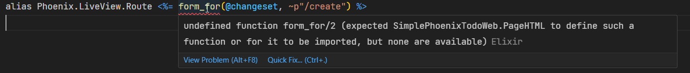

On forum I found this [article](https://phoenixonrails.com/blog/you-can-stop-using-form-for-in-phoenix) and changed form to:

```elixir
<.form :let={f} for={@changeset} action={~p"/create"}>
  <.input field={f[:title]} />
</.form>
```

and finally got some form in template.

Another error now trying to display error flash messages with code from GPT:

```elixir
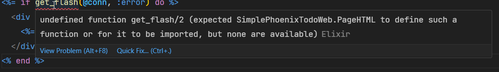
```

I am getting tired of these errors. [Documentation](https://hexdocs.pm/phoenix/controllers.html#flash-messages) shows how to create flash message, but not how to render. I guess I'll have to google.

In this [post](https://elixirforum.com/t/no-function-clause-matching-usercontroller-create-method-when-posting/35746) I saw some code and this works:

```elixir
<%= live_flash(@flash, :error) %>
```

except now I get warning `live_flash` is deprecated, but you know what? IDGF, I've spent already too much time. If it works, it will be shipped. Only thing is I don't see what is the error here since Phoenix doesn't show model save error, now I have to put it in the flash message. Another thing IDGF anymore. I gotta move on.

Another error: This time it's

```
FunctionClauseError at POST /create
no function clause matching in Phoenix.Controller.redirect/2
```

for this Controller:

```elixir
import Ecto.Query
alias SimplePhoenixTodo.{Repo, Todo}

defmodule SimplePhoenixTodoWeb.PageController do
  alias Phoenix.Router.Route
  use SimplePhoenixTodoWeb, :controller

  def home(conn, _params) do
    # The home page is often custom made,
    # so skip the default app layout.
    changeset = Todo.changeset(%Todo{}, %{})

    render(conn, :home, layout: false, changeset: changeset)
  end

  def create(conn, %{"todo" => todo_params}) do
    changeset = Todo.changeset(%Todo{}, todo_params)
    IO.inspect(todo_params, label: "Todo Params")

    case Repo.insert(changeset) do
      {:ok, _todo} ->
        conn
        |> put_flash(:info, "Todo created success")
        |> redirect(~p"/")

      {:error, %Ecto.Changeset{} = changeset} ->
        conn
        |> put_flash(
          :error,
          "Failed to create todo"
        )
        |> redirect(~p"/")
    end
  end
end
```

What am I doing wrong now? GPT keeps saying I need to use `redirect(to: Routes.page_path(conn, :home))`, but when I use that than I get warning `Routes.page_path/2 is undefined (module Routes is not available or is yet to be defined)`. I am REALLY now getting annoyed. Seems like we need to put `to:` in `redirect`: `redirect(to: ~p"/")`, but why GPT doesn't say that? This is the disatvantage of not so popular libraries. In the future this will be very important. We used to say googlebility, but now we will say GPTability of some library. Only when AI will be able to read documentation and answer questions it will not matter as much.

After some more problems I have accepted that GPT doesn't really know Phoenix or Elixir and cannot rely as much as for Typescript and React for example. I won't even mention them anymore. At this point I am not interested in learning anymore and reading documentation. Just want to ship this todo and move on to another project.

#### Final word

I rushed to get this done. At this point I have stopped enjoying learning. GPT code is outdated. It's simply too much to learn and resources are not as available as for more popular libraries and languages. As a hobbyst I need to get answers fast because I don't have much time in a day and this framework and language doesn't provide that compared to some others. I believe it's good framework, there is high satisfaction on [Stack overflow survey](https://survey.stackoverflow.co/2024/technology/#2-web-frameworks-and-technologies), but it's not for me. I would do it maybe if I am professional or paid to work on it.

### Nextjs (app)

[repo](https://github.com/tombohub/simple-nextjs-todo)

#### Workflow

Right off the bat, unlike the other frameworks, I had to find ORM to use. I am using Drizzle. That means we have to hook up library for something essential like database access as well as any other library and then make them all work together. It's a mess bound to happen. I am not gonna go into the definition of full stack framework, but certainly it's not battery included framework.

Ok, drizzle is giving error that todos table doesn't exist when it obviously does, I am gonna use kysely.

Ok, it's the same error:


Seems like this is the Nextjs problem. Why? This is the code:

```javascript
import { db } from "@/db";

export default function Home() {
  async function createTodo(formData: FormData) {
    "use server";
    const title = formData.get("title");
    const status = "Not Done";
    await db.insertInto("todos").values({ title, status }).execute();
  }
  return (
    <>
      <form action={createTodo}>
        <input name="title" />
        <button>Add</button>
      </form>
    </>
  );
}
```

It can be hardly any more simpler. What's the problem?

After some more tinkering seems like problem is not in Nextjs it's in nodejs itself, or combination of node and kysely | drizzle. I mean it's hilarious I am still trying to query database after like 2 hours.

Trying to use just the [better-sqlite3](https://www.npmjs.com/package/better-sqlite3) package already giving `esModuleInterop` flag, cannot run on node command line `TypeError: import_better_sqlite3.Database is not a constructor`, this is bloody disaster. Ok... Let's try the [node sqlite3](https://www.npmjs.com/package/sqlite3).

Ok `sqlite3` worked.

I am ashamed to admit I copy pasted database link and it didn't paste backslashes. That means it was not able to connect to database. It was giving me error like table doesn't exist instead of cannot connect to database. And that is why kids, you need good ORM because it checks all these errors and other crap. You don't want to reinvent infrastructural patterns like database abstraction which is already solved thousands of times. Leave that to the pros and focus on business logic. Ok moving on with `kysely` and `better-sqlite3`.

I am having todos listed and able to insert into database, but now I have to revalidate because it doesn't do by itself.

Using [on demand revalidation](https://nextjs.org/docs/app/building-your-application/data-fetching/caching-and-revalidating#on-demand-revalidation) todos are refreshed after mutation, but the input stays with old value. This is what I mean. We have to do all these small things ourselves. Framework is supposed to have sensible defaults and in this case user expects input to reset after submit. Leaving old value is good in some app like scenarios, but most of the time submit form means new fresh form after successful submission. And it's not super simple thing to do based on [this reddit post](https://www.reddit.com/r/nextjs/comments/1cdd2bm/how_do_you_reset_a_form_upon_submitting_it_with/). I am not gonna fix this. There is more stuff like validation, status messages etc which seems like I will have to do myself or find a library. I don't have time for that.

I think I am done with Nextjs, I never liked and I don't like it after this also. I got the gist what is server component and action all about and that's good enough for me.
Here are some other opinions:

#### Architecture

Nextjs doesn't follow any architecture and I am surprised people mention it like a solution to organizing app. I think it's just glorified router. No architecture here.

#### UI flow

Best thing about Javascript frameworks is they best hot reload and we can see changes immediately. It works in vscode simple browser, while other real server render frameworks show blank page.

#### Conclusion

I mean server components are nice thing. Feels good to be able to query database and also use typescript frontend and react components and libraries. Problem is Nextjs is not **battery included** framework and I wouldn't use it as a full on solution. There is lot of plugging we need to do and it's a waste of time. Just look at what's included in [Laravel](https://laravel.com/docs/11.x/artisan). We barely need to do any infrastructural logic and we can focus on business logic. That's what framework is supposed to provide. I would call Nextjs frontend framework and that's it. At best it can be used as [backend for frontend](https://learn.microsoft.com/en-us/azure/architecture/patterns/backends-for-frontends) framework. I am gonna presume Remix, Nuxt, Sveltekit is the same thing.

### Symfony

[Repo](https://github.com/tombohub/simple-symfony-todo)

#### Workflow

I have already installed symfony from before. Starting new project is with command line

```console
 symfony new --webapp simple-symfony-todo
```

Let's create a todo model. Seems like in Symfony there is command line for everything, even for creating a model which in Symfony are php classes, like Django.

First we need to install some packages:

```console
composer require symfony/orm-pack
composer require --dev symfony/maker-bundle
```

Then create an entity:

```
php bin/console make:entity
```

This is nice. It even gives you help right there right now

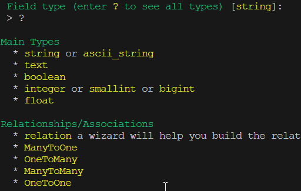

Ok let's go with enum type. It asks me to put which enum class it is so I need to create it. Luckily, Copilot knows what to do. In the end Symfony generated lot of code:

```php
<?php

namespace App\Entity;

use App\Enum\TodoStatus;
use App\Repository\TodoRepository;
use Doctrine\ORM\Mapping as ORM;

#[ORM\Entity(repositoryClass: TodoRepository::class)]
class Todo
{
    #[ORM\Id]
    #[ORM\GeneratedValue]
    #[ORM\Column]
    private ?int $id = null;

    #[ORM\Column(length: 255)]
    private ?string $title = null;

    #[ORM\Column(enumType: TodoStatus::class)]
    private ?TodoStatus $status = null;

    public function getId(): ?int
    {
        return $this->id;
    }

    public function getTitle(): ?string
    {
        return $this->title;
    }

    public function setTitle(string $title): static
    {
        $this->title = $title;

        return $this;
    }

    public function getStatus(): ?TodoStatus
    {
        return $this->status;
    }

    public function setStatus(TodoStatus $status): static
    {
        $this->status = $status;

        return $this;
    }
}
```

That is a lot of code for 2 properties. Is PHP like Java to need to have getter and setter for each property? Maybe there is shorter version, but it's not important right now.

One thing I need right now is to make `status` property default to `Not Done`. Copilot suggests assigning default value to the property. I guess that's how Doctrine work, it is just a PHP class after all:

```php
#[ORM\Column(enumType: TodoStatus::class)]
    private ?TodoStatus $status = TodoStatus::NOT_DONE;
```

Migration went smooth, no problems there. What's interesting is that created table is called `todo`, unlike `todos` previous frameworks. As a side note Symfony [docs](https://symfony.com/doc/current/doctrine.html) are easy to read along and I find myself not needing Copilot as much. Dare contrast to the Phoenix.

Create controller now. Command works fine. Again `todo` instead of `todos`:

```php
class TodoController extends AbstractController
{
    #[Route('/todo', name: 'app_todo')]
    public function index(): Response
    {
        return $this->render('todo/index.html.twig', [
            'controller_name' => 'TodoController',
        ]);
    }
}
```

I actually prefer this literal configuration because I am learning strictly code and not some convention/surprises. As you can also see, routes are defined inside the PHP class annotation. No extra `routes.php`. Maybe there is option, but this is the default.

I am trying to run server, but Copilot give command `php bin/console server:run` which doesn't work. Correct command to start server is `symfony serve` using symfony cli tool. All the `php bin/console` commands we can run with `symfony console`.

Documentation is really nice and readable. I managed to create form and submission wen smoothly, no errors on the first run.

Now, I am gonna apply some validation on todo title. Symfony once again asks to install another package for validation. It really is lot of package installing. Validators are easiest to apply as annotation on entity:

```php
    #[Assert\Length(min: 3)]
    private ?string $title = null;
```

It worked first time and error message was displayed as part of the form. Just like in Django. We don't need to do error checking and display error if there is any. Mental load relieved.

I have added flush message very easy also: `$this->addFlash('info', 'Todo created');`.

Everything is going smooth. Much different than Phoenix.

Ok, trying to change status of todo I got an error: `Unable to generate a URL for the named route "dsad" as such route does not exist.` I guess I put 'dsad' somewhere and now I forgot where. It doesn't say where in the error. In this regard Django error report is still unmatched.

#### Architecture

Symfony is based on Dependency injection. It's IoC container and practically anything we want to use we need to install symfony package. There is a LOT of things here. Laravel is based on Symfony and is also IoC container. Laravel is Symfony with shortcuts. In symfony there is command line to generate controllers, models, views etc and everything has it's place. Plugins are integrated and no need for reinventing the infrastructural wheel like we have to do for so called full stack frameworks like Nextjs. This is what framework is supposed to be. Hence the name -> FrameWork.

#### ORM

Orm is [Doctrine](https://www.doctrine-project.org/), looks like Data Mapper pattern. Very explicit, need to declare [Plain old PHP objects](https://stackoverflow.com/questions/41188002/what-does-the-term-plain-old-php-object-popo-exactly-mean) and it's called Entity

#### Forms

Symfony has form framework/builder, like Django. That's nice. Here is an example:

```php
$form = $this->createFormBuilder($task)
            ->add('task', TextType::class)
            ->add('dueDate', DateType::class)
            ->add('save', SubmitType::class, ['label' => 'Create Task'])
            ->getForm();
```

This is good, I support that. I think ASP.Net Core should do the same. There is so much you can do with creating forms, check the [docs](https://symfony.com/doc/current/forms.html). We can even use command line to generate forms. Killer feature. I would say, on the first look, even more powerful than Django forms. Those 2 have different approaches. Django uses Attribute access to work on form in template

```html
{{ form.field.errors }}
```

while Symfony is more functional approach:

```php
form_errors(form.field)
```

I really like Django, but Symfony is growing on me. They have different goals. Django aims for rapid development, Symfony for slower and and stable.

#### Template

Template is Twig. Don't know much about it. Looks same as Django template. One thing I like is passing params to the route is explicit:

```twig
<a href="{{path('app_toggle', {'id': todo.id})}}">Done</a>
```

It's interesting we can pull in PHP enum inside the template:

```twig
<a href="{{path('app_toggle', {'id': todo.id})}}">
            
                Mark as Not Done
            
                Mark as Done
            
        </a>
```

Still not typed like Razor templates, but better than Django

#### Final Thought

Symfony is so far best framework, for me, I've tried in this trial. It's simply design to scale, architectural expansion, providing anything you'll ever need. Everything is based on modular, decoupled design. Pro level. Laravel is crippled version of Symfony designed to skip steps in order to speed up development. Each one has a purpose, but if I am gonna do project for years and complex domain logic I would definitely use Symfony. I am honestly bamboozled how come is not more popular, but on the other hand not so much. People like easy solutions and Laravel, Django and Rails seems easier to learn than Symfony. Symfony has very distinct layers and it can be tedious or harder to understand for beginners, usually referring it to `boilerplate`, but it's what it takes for for framework to allow you to scale architecturally.

### Adonis

[Repo](https://github.com/tombohub/simple-adonis-todo)

Adonis has live reload, always a good thing about javascript frameworks.
It's based on Laravel and I expect to be fairly similar.

Created model `Todo` with command `node ace make:model Todo`. Very nice, as I expected. Run migrations, ok. Now problem, I don't know where is the sqlite database, can't find it in project folders. Doesn't matter, as long as data is somewhere there. I forgot to add `title` and `status` columns. I have added them to the Todo class, but it still created migration for creating a table, without new fields. I found database. It's in `tmp` folder. Tried again it doesn't create fields in migration.

Controller and route went smooth. We have to create route in another file. After Symfony I prefer to create router along with controller, colocation. There is no form module so I will have to create form and hook it up myself. Copilot so far helpful

I am not gonna implement flash message and validation. Adonis has both and I have no doubt it's working good. Adonis is good framework. It's pitty that people are swindled by marketing from dev 'celebrities' and big companies and don't give Adonis recognition it deserves.

#### ORM

Orm is [Lucid](https://docs.adonisjs.com/guides/database/lucid). Has commands for creating models and making migrations. Migrations are semi automatic, it creates table with default columns, but the ones extra we need to add ourselves. Its Active Record:

```javascript
const todo = new Todo();
todo.title = data.title;
await todo.save();
```

#### Tooling

Adonis has a cli for generating stuff you need. I like the vscode help :

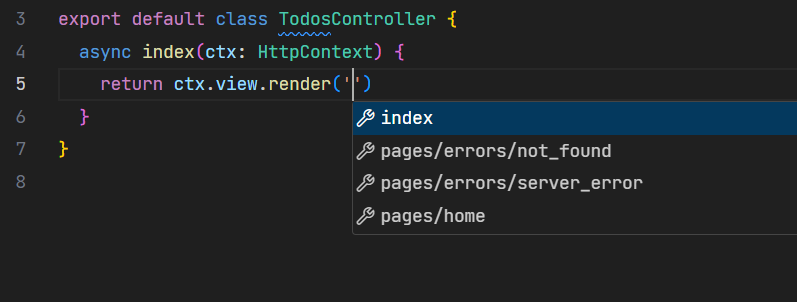
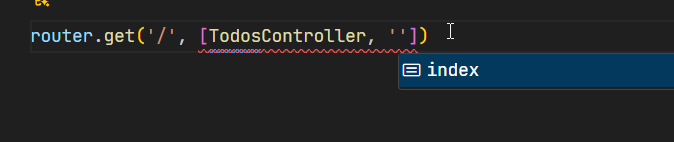

#### Routing

There is not automatic binding, we have to do ourselves:

```javascript
  async toggle(ctx: HttpContext) {
    const todoId = ctx.params.id
  }
```

Like Symfony, route params in template are explicit:

```edge
<a href="{{route('toggle'), {id: todo.id}}}">Done</a>
```

Little bit annoying to write this long redirect:

```js
return ctx.response.redirect().toRoute("index");
```

#### Template

Template engine is [Edge](https://edgejs.dev/docs/introduction). Good thing about it is we can write javascript:

```js
    <a href="{{route('toggle', {id: todo.id})}}">
        {{todo.status === 'Done' ? 'Mark Not done' : 'Mark Done'}}
    </a>
```

Still not typed and I am not sure if we can import types from outside like we can in Symfony.

#### Final word

Adonis is not bad. It's something in between Laravel and Symfony, much closer to Laravel. If you want to use Typescript it's very good. It has ORM, template, storage I recommend. I am little bit sustained because nodejs tooling, typescript and all that stuff, doesn't feel stable. Maybe it's just a feeling and reality is different. What is important is you feel good about writing in framework. You don't want that baggage always whispering in your ear while trying to code.

### Nestjs

[Repo](https://github.com/tombohub/simple-nestjs-todo)

#### Workflow

This is IoC container for typescript. Installation successful. Running server is `npm run start` instead of `npm run dev`. It doesn't show port number:

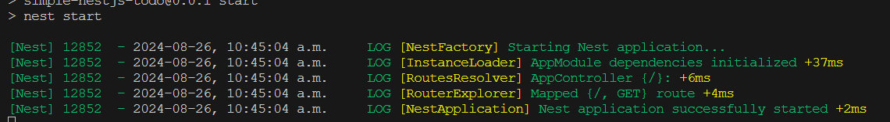

Bunch of lint errors:

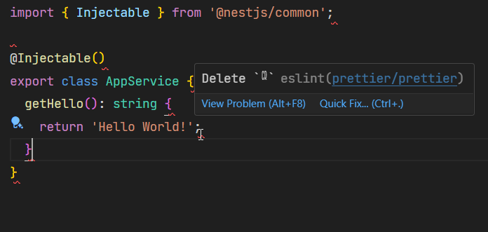

No live reload. Changing something I need to restart server and refresh the page. That's a downer. We have to use `npm run start:dev`, which reloads server, but not the page. Better than nothing.

#### Creating Model

Seems like I need to install ORM of my choice. Most supported one is [TypeOrm](https://typeorm.io/). Means there is no sqlite out of the box to start going fast.
Documentation is here under the [`Techniques`](https://docs.nestjs.com/techniques/database). I mean why techniques?

```console
npm install --save @nestjs/typeorm typeorm sqlite3
```

Ok, It doesn't say how to hook up sqlite, I wanted to write shortcut to database something like `@/db.sqlite`, but I don't know if it's gonna work. Do I need to put full path? Googling `Nestjs sqlite` first result is Sequilize, not TypeOrm.

There is this code for setting up the module

```js
import { DataSource } from 'typeorm';

@Module({
  imports: [TypeOrmModule.forRoot(), UsersModule],
})
export class AppModule {
  constructor(private dataSource: DataSource) {}
}
```

`UsersModule` appeared it wasn't there before. Is it important? Where is it coming from? I am not gonna research, only ignore.

Seems like there is no command to create entity. I have to do myself.

Literally copied the example from [docs](https://docs.nestjs.com/techniques/database#repository-pattern) and having all these errors ( I have reloaded window ):

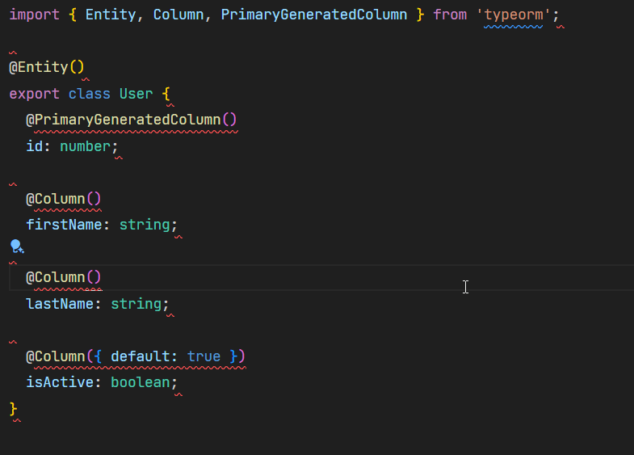

What now? Googling again? Why even documentation example doesn't work? If this keeps on happening I am just gonna give up, I have no time for this. This is one of the error:

```js
Unable to resolve signature of property decorator when called as an expression.
  Argument of type 'ClassFieldDecoratorContext<User, number> & { name: "id"; private: false; static: false; }' is not assignable to parameter of type 'string | symbol'.ts(1240)
```

Whatever that means.

.... I went to play some guitar and when I came back errors disappeared:

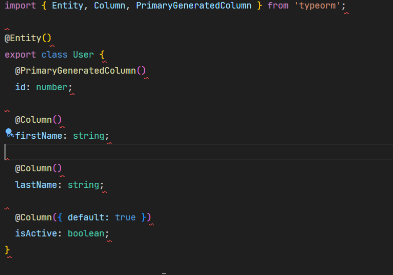

Wow. Ok. If only other problems can be resolved like this.

We need to hook up everything in `app.module.ts`, then we create another module for like `Todo`. I guess that's what they mean when they say _boilerplate_

#### Views

I've decided to move on to create a view. There is no command line for view. We need to create `views` folder and file inside.

We also need to install template engine. Nests says `hbs`. We need to set it up in `main.ts`:

```js
import { NestFactory } from "@nestjs/core";
import { AppModule } from "./app.module";
import { NestExpressApplication } from "@nestjs/platform-express";
import { join } from "path";

async function bootstrap() {
  const app = (await NestFactory.create) < NestExpressApplication > AppModule;
  app.useStaticAssets(join(__dirname, "..", "public"));
  app.setBaseViewsDir(join(__dirname, "..", "views"));
  app.setViewEngine("hbs");
  await app.listen(3000);
}
bootstrap();
```

I have passed object to the template, but there was no error, just blank page.

```js
import { Controller, Get, Render } from '@nestjs/common';
import { InjectRepository } from '@nestjs/typeorm';
import { AppService } from './app.service';
import { Repository } from 'typeorm';
import { Todo } from './todo.entity';

@Controller()
export class AppController {
  constructor(
    private readonly appService: AppService,
    @InjectRepository(Todo) private todoRepo: Repository<Todo>,
  ) {}

  @Get()
  @Render('index')
  async index() {
    const todos = await this.todoRepo.find();
    return { todo: todos[0] };
  }
}
```

```hbs
{{todo.title}}
```

If I did something wrong I expect an error. There is no feedback here and that's a recipe for lot of time debugging.

#### Final word

Nestjs doesn't seem suitable for regular so called MVC framework (they are more like [Action-Domain-Responder](https://en.wikipedia.org/wiki/Action%E2%80%93domain%E2%80%93responder) pattern.

There is no integrated orm, views, everything seems to need to plug in in module, like older versions of Angular. Combined with finnicky experience characteristic to Javascript and Typescript tooling, ecosystem etc, I don't have compelling reasons at the moment to use this framework over the [Adonis](https://adonisjs.com/) or even [Remix](https://remix.run/) if I really want to use Typescript, especially compared to [Symfony](https://symfony.com/). It doesn't feel cohesive enough for I am looking for.

### Spring Boot

#### Workflow

I will use this [tutorial](https://docs.spring.io/spring-boot/tutorial/first-application/index.html). I also expect GPT and Copilot to be grate help since this is well known framework.

I don't think I will use this framework either so I'll try to do fast.

I followed the instructions, copy pasted code and when I run app got the error:

```console
[ERROR] Failed to execute goal org.springframework.
boot:spring-boot-maven-plugin:3.3.3:run (default-cli) on
project myproject: Process terminated with exit code: 1 ->
[Help 1]
```

Not a good start. I mean if starting example doesn't work how can I trust the future. I'll give it one more chance and download starter template.

Downloaded demo from https://start.spring.io/. `mvn spring-boot:run` at least doesn't give error, but also doesn't run application... It says `BUILD SUCCESS`. I expected to run app like they say in docs. `./mvnw spring-boot:run` also doesn't run the app.

Let's try one more time with this guide: https://spring.io/guides/gs/serving-web-content.
In this one command `mvn spring-boot:run` doesn't start the app, but `./mvnw spring-boot:run` does. Interesting. What's more interesting is after trying again `mvn spring-boot:start` is now running the app. Do you see how this can be confusing to beginners? I have just spent like 45 min trying to merely start the app.

I have changed the template little bit and server doesn't reload. I am not gonna try to find solution, on first google search didn't come up. Moving on.

#### Controller

There is no command for creating controller.

In `TodoController.java` file trying to type `@Controller` hoping it will offer import, but it doesn't:
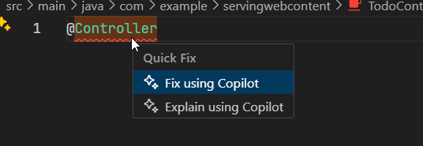
I guess manual or copy paste.

I've pasted imports. Trying now to type `@Controller` no intellisense:
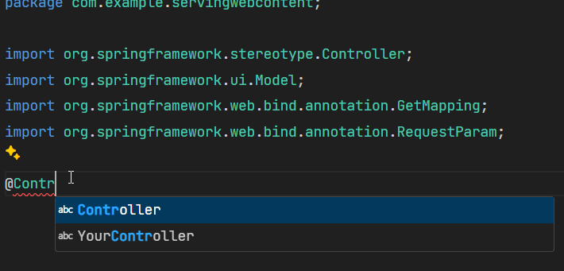

I expected full on intellisense Java being static language. Is it because of Vscode? Something is off? Let's try the [IDEA](https://www.jetbrains.com/idea/). Seems like it's working:

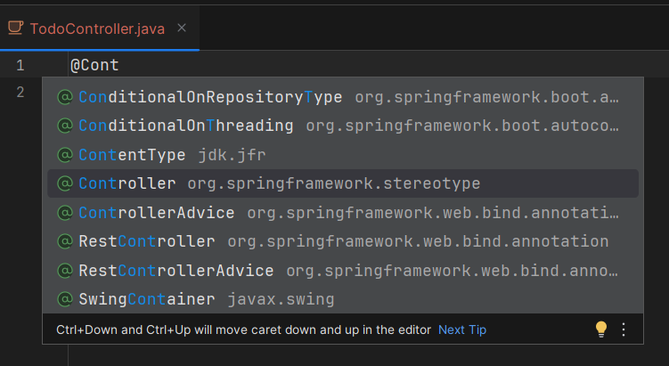

After reloading Vscode intellisense works:

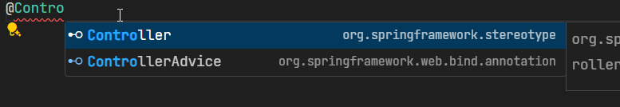

I've expect this to return string:

```java
package com.example.servingwebcontent;

import org.springframework.stereotype.Controller;
import org.springframework.web.bind.annotation.GetMapping;

@Controller
public class TodoController {
    @GetMapping("/")
    public String index() {
        return new String("dasa");
    }
}
```

but it seems it want's to render the view called `dasa`. This is the error page:

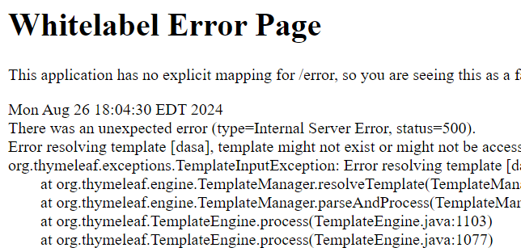

We have to use `@ResponseBody`:

```java
@Controller
public class TodoController {
    @GetMapping("/")
    @ResponseBody
    public String index() {
        return new String("dasa");
    }
}
```

#### Final words

At this point I am satisfied with what I saw. I will not use this framework also. Seems like traditional MVC framework for which I now know what to expect. Experiencing problems to start right at the beginning is discouraging as well I am pretty much more satisfied with Symfony as a similar framework. Documentation of Spring doesn't look as approachable as Symfony. I am not also attracted to [Thymeleaf](https://www.thymeleaf.org/) template. I like the spring boot [dashboard](https://marketplace.visualstudio.com/items?itemName=vscjava.vscode-spring-boot-dashboard) tho! Similar thing has [Adonis](https://marketplace.visualstudio.com/items?itemName=jripouteau.adonis-vscode-extension) also.

### ASP.Net core MVC

[Repo](https://github.com/tombohub/simple-aspnetcoremvc-todo)

#### Workflow

For this one I will use [Visual Studio 2022](https://visualstudio.microsoft.com/) and Vscode, will see how they compare.

I have experience with ASP.Net core one so It's gonna be easy. That's why I left it for last.

#### Controller

Example controller is already created. There is command for generating controller `dotnet new mvccontroller` , but it creates controller in project root instead of conventional `Controllers` folder. Why? Is it not based on convention? So I will not use command. There is scaffolding option in Visual Studio.

Simplest controller:

```csharp
using Microsoft.AspNetCore.Mvc;

public class TodoController : Controller
{
    public string Index()
    {
        return "dsa";
    }
}
```

#### View

Asp net core has some conventions. We need to create view in the same folder as the name of the controller without the `Controller` part. In my case I have controller `TodoController` so the views need to be in `Views/Todo` folder. Controllers Action determines the name of the view file. So if action is called `Index` like above the view file is `Index.cshtml`. Full path is `Views/Todo/Index.cshtml`

I don't know if there is command. I will create a file.

File created. With command `dotnet watch` we get hot reload where we don't even need to refresh browser. Only Phoenix gets that out of the box.

This is the content of the view: `hello`. That's it, but we still get the layout. No need for  like in some other templates. There is `_ViewStart.cshtml` file which takes care of configuring which layout to use:

```csharp
@{
    Layout = "_Layout";
}
```

Controller to render the view looks like this:

```csharp
public class TodoController : Controller
{
    public IActionResult Index()
    {
        return View();
    }
}
```

Very neat, convention like Rails, with static typing.

#### Model

Good thing about .NET ecosystem is that libraries are pretty much set. No need to research. In ORM case it's [EF core](https://learn.microsoft.com/en-us/ef/core/). So let's just do it. I'll use sqlite.

Gotta install some packages. ASP is like Symfony, IoC container where we plugin what we need. Except, I would say, Symfony's packages are more discoverable.

One thing I'd like to point out is that there is no out of the box `created_at` and `updated_at` fields for EF core model. Microsoft's behavior is weird in this framework. It's like some things the made super easy some things like they don't care and think we should do ourselves. Also some things are missing from the framework what others usually have. The goal is not clear, are they creating web framework or what? Is it still not finished?

There is some plugging to do around creating a database context and adding it to service container. More work than Symfony Doctrine ORM.
This is the line to ass service:

```csharp
builder.Services.AddDbContext<TodoDbContext>(options =>
options.UseSqlite("Data Source=db.sqlite"));
```

Notice the `Data Source=db.sqlite`. Another special case.

Trying to make migrations while app is running was giving errors. I have to stop the app.

Migration worked.

#### Form

There is not intellisense in vscode for razor templates:
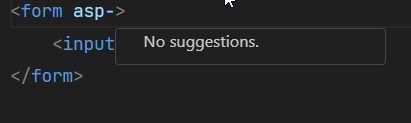

I will switch to Visual Studio. Vscode is just tryout. Still work in progress.

In [Razor templates](https://learn.microsoft.com/en-us/aspnet/core/mvc/views/razor?view=aspnetcore-8.0) we can declare view model type:

```razor
@model IEnumerable<TodoModel>

<form asp-action="Create" method="post">
    <input asp-for="Title" />
</form>
```

which is good for type safety in templates, but it requires little bit more of a code because we cannot simply pass array like in Symfony:

```php
return $this->render('index.html.twig', [
            'form' => $form,
            'todos' => $todos
        ]);
```

and deal with single todo, list of todos and anything we assign into the array. Because we can only have one `@model` directive we have to create a class to design view model for this particular view. So that's what I am gonna do.

Good thing about Visual Studio it has free AI intellisense:

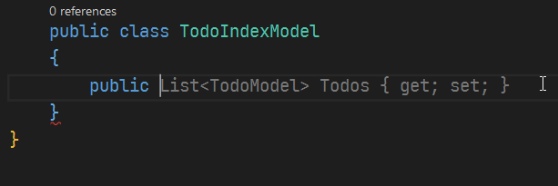

It's really smart, like knows exactly what I need:

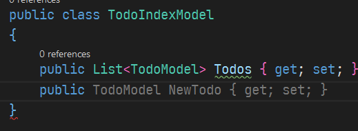

Now we can see here price for fully static typing. Because I have designed EF core model with `required` modifier, meaning it cannot be null, now I have to initialize it every time I create instance:

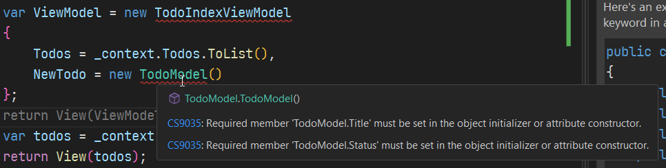
<sub>I've renamed view model to TodoIndexViewModel</sub>

It's not like in Symfony Doctrine where this doesn't cause error:

```php
 $todo = new Todo();
```

We would have to create another class without required properties and then map to the EF core model with required properties after form submission. Yes, price of static typing. I can use Attributes to make the field required, but I am not sure if it would result in database column `NOT NULL` after migration. This is what I did, not there is no error:

```csharp
using System.ComponentModel.DataAnnotations;

namespace simple_aspnetcoremvc_todo.Models
{

   public enum TodoStatus
   {
       Done,
       NotDone
   }

   public class TodoModel
   {
       public int Id { get; set; }

       [Required]
       public string? Title { get; set; }
       [Required]
       public TodoStatus Status { get; set; } = TodoStatus.NotDone;
   }
}
```

And after migrations they are still `NOT NULL`, beautiful!

Now I can use that View model inside the template:

```razor
@model TodoIndexViewModel

<form asp-action="Create" method="post">
    <input  asp-for="@Model.NewTodo.Title"/>
</form>


    @foreach(var todo in Model.Todos)
    {
        <div>
            <h3>@todo.Title</h3>
        </div>
    }
```

Asp net core is using [tag helpers](https://learn.microsoft.com/en-us/aspnet/core/mvc/views/tag-helpers/intro?view=aspnetcore-8.0) like `asp-for` to bind input value to the model property. Something like Rails I guess? But typed of course.

Let's run and oops there is an error page:

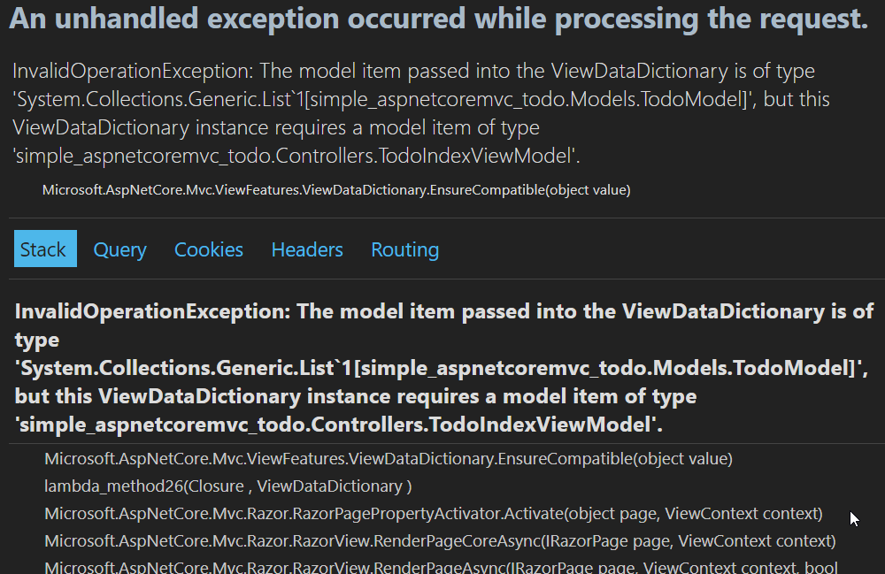

Man it's ugly. This is what I mean, it looks unfinished.

Compare it to Symfony error page:

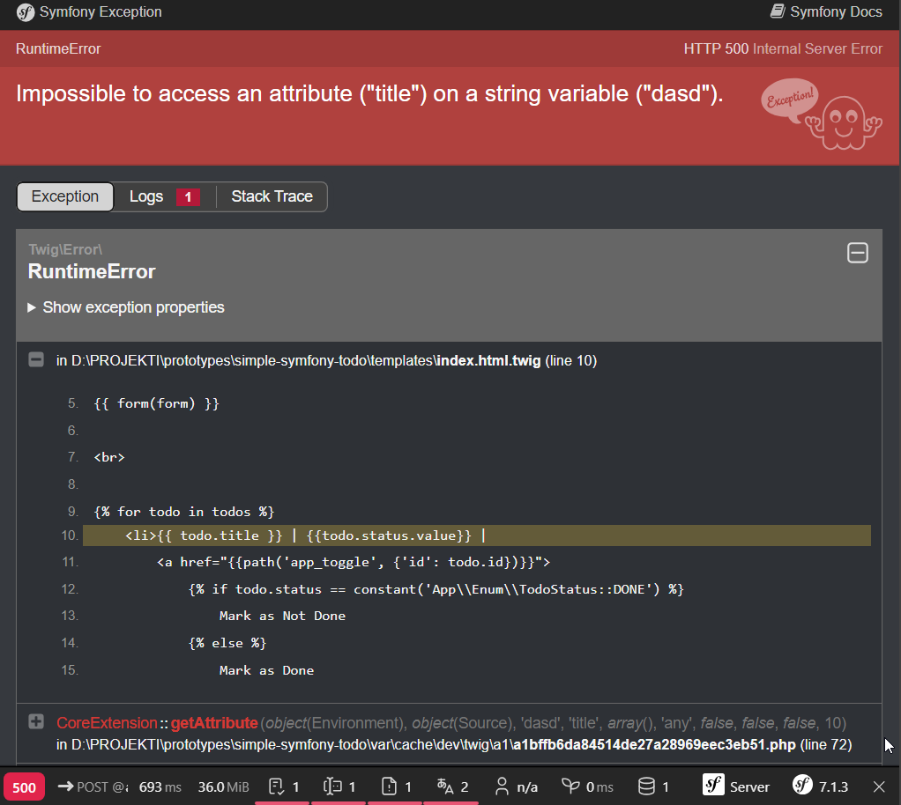

Looks like a professional. Even has a debug toolbar at the bottom.

The reason for error is that I declared one type in the view template:

```razor
@model TodoIndexViewModel
```

but passed another type in the controller:

```csharp
public IActionResult Index()
{
    var ViewModel = new TodoIndexViewModel
    {
        Todos = _context.Todos.ToList(),
        NewTodo = new TodoModel()
    };

    var todos = _context.Todos.ToList();
    return View(todos);
}
```

Have to pass the view model I created:

```csharp
        public IActionResult Index()
        {
            var ViewModel = new TodoIndexViewModel
            {
                Todos = _context.Todos.ToList(),
                NewTodo = new TodoModel()
            };

            return View(ViewModel);
        }
```

It's working now.

So Asp net static typing gives me error right away while Symfony dynamic PHP gives error when trying to access the non existing property.
You can pass anonymous object into the Razor view and declare model as `@model dynamic`, but then you guessed it, lose on static typing and intellisense.

Static typing in templates also means we need to recreate the view model in other controller action if we want to render Index template:

```csharp
        public IActionResult Create(TodoIndexViewModel viewModel)
        {
            if (ModelState.IsValid)
            {
                _context.Todos.Add(viewModel.NewTodo);
                _context.SaveChanges();
                return RedirectToAction("Index");
            }
            viewModel.Todos = _context.Todos.ToList();
            return View("Index", viewModel);
        }
```

In `Create(TodoIndexViewModel viewModel)` viewModel instance is passed to `Create` action after form submission. We don't need to get payload from `Request`. Asp net core does binding behind the scene. Very nice.

Move on. After form submission i got the error

```
AmbiguousMatchException: The request matched multiple endpoints. Matches:

simple_aspnetcoremvc_todo.Controllers.TodoController.Create (simple-aspnetcoremvc-todo)

simple_aspnetcoremvc_todo.Controllers.TodoController.Create (simple-aspnetcoremvc-todo)
```

I only have one `Create` action. I presume I need to rebuild and restart the app. I was correct. Perks of compiled language. Form submission doesn't work. There is no error message. I remember Asp net core is doing client side validation using jquery validation so I will put place for error message adding `span` tag and `asp-validation-for` tag helper:

```razor
<form asp-action="Create" method="post">
    <input  asp-for="@Model.NewTodo.Title"/>
    <span asp-validation-for="NewTodo.Title"></span>
    <span asp-validation-for="NewTodo.Status"></span>
    <button type="submit">Add</button>
</form>
```

Still nothing. Ok, framework should tell where are the errors. Let me debug this a little bit...

With the help of GPT I found out that the issue was in `TodoIndexViewModel`. Previously I had

```csharp
    public class TodoIndexViewModel
    {
        public required IEnumerable<TodoModel> Todos { get; set; }
        public required TodoModel NewTodo { get; set; }
    }
```

but after submission `Todos` was null so the `ModelState.IsValid` was false. I changed the view model to:

```csharp
    public class TodoIndexViewModel
    {
        public IEnumerable<TodoModel>? Todos { get; set; }
        public TodoModel? NewTodo { get; set; }
    }
```

and now I can create new todos. It's little bit unconventional because I am passing back to the `Index` from `Create` and now have to be careful how to model views. Stick to the asp net core mvs convention in this case. Render form in `Create` view.

#### Final Word

It's pretty good framework. It's more of a container than a full on frameworks because many things are missing for the developer convenience, for example [pagination](https://learn.microsoft.com/en-us/aspnet/core/data/ef-mvc/sort-filter-page?view=aspnetcore-8.0#add-paging-to-students-index). I don't know if it's expected of us developers to create those things or the framework is not finished. Are they focusing more on performance and let us create all the plugins? It's targeted for enterprise where they have money and man power? How come Symfony has all those things of convenience.

There is framework built on top of the ASP.NET Core called [ABP framework](https://abp.io/) which I tried to use, but it couldn't create a project or I didn't know how. It's very opinionated framework with DDD architecture and it has all the things missing in bare bones ASP.NET Core, like [Mailer](https://abp.io/docs/latest/framework/infrastructure/emailing), [Scheduler](https://abp.io/docs/latest/framework/infrastructure/background-jobs) and many more.

It's a mix of convention and explicitness. Some conventions like Rails, even more - we don't need to even declare routes, they are generated from controller and action names, but still decoupled and architecturally expandable. It's on a very good path. I still think it needs some developer tools and better error reports, admin, toolbar, plugins. C# is a beautiful language, needs a little bit of extra code, but once it works you know it works and it's just keep getting better. Soon enough they even might have [Discriminated Unions](https://github.com/dotnet/csharplang/blob/18a527bcc1f0bdaf542d8b9a189c50068615b439/proposals/TypeUnions.md).

Asp.net core has something no other framework has - typed templates. With Blazor components it almost becomes like TSX. I resisted htmx because I don't like stringly typing, but with Razor template we could have typed htmx with intellisense.

### Final Final Word

This was an ordeal to test all these frameworks. Some gave me lot of work like [Phoenix](https://www.phoenixframework.org/), some gave me headache like [Nestjs](https://nestjs.com/).

The goal was to evaluate which framework I will use for my personal long term project. Think of 10 years and more.

Biggest discovery was Symfony, I've never really considered it, and now it's top one. Also how PHP is actually good. It has typed function signatures and rest of it can be type hinted with comments. Not my favorite, but I'll take what I can get.

Regarding language, my opinion after this is that best language for solo dev is the progressive typing one and honestly, after this test, I think that can be PHP.
Python has more types and type hinting is better, but there was always something off. Python has other issues like imports and packaging and other small things. To this day I don't know how to import sibling package.
Typescript has issues around configuration and bunch of tooling. [Vite](https://vitejs.dev/) solves that for the web, but for nodejs it's still a mess. We can use Vite, but it's primarily designed for web.
That leaves us with PHP here. We can even simulate discriminated union and pattern matching with enums. Enums, unlike C# can hold other [values](https://stitcher.io/blog/php-enums) than integer. I think that's amazing. So for solo dev I recommend progressive typed languages. For many people something like Java and C# I am guessing is most popular.
I always avoid fully dynamic because it doesn't help me at all. Every time waste time coming back to the project after few months. That's why I am not using Ruby even tho I like the language.

So, I will further evaluate 2 frameworks: Symfony and Asp.net core. That will be the next post.
